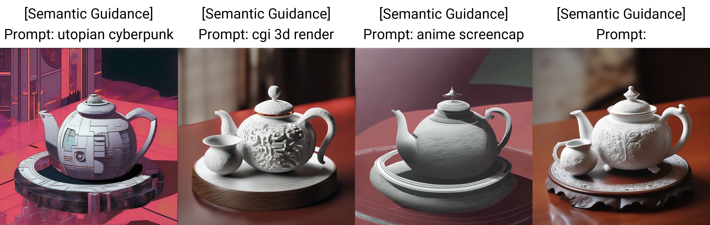
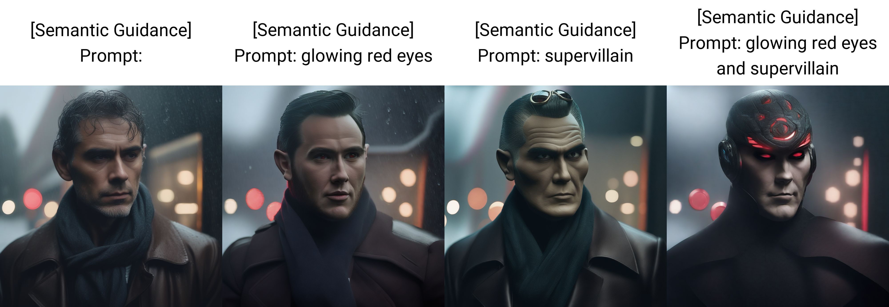
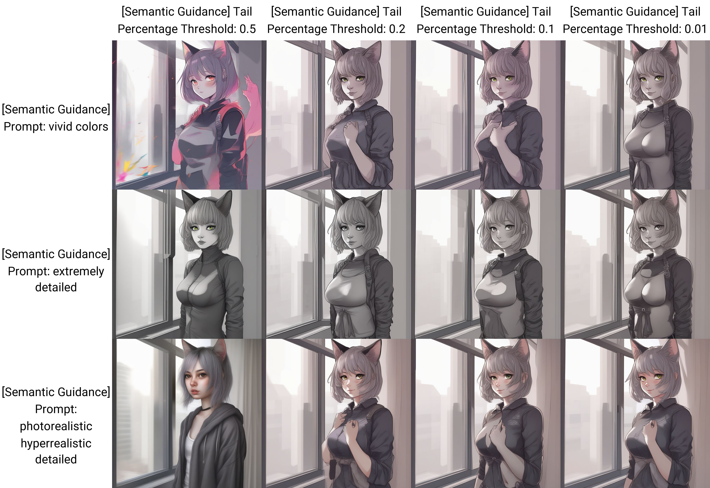

## sd-webui-semantic-guidance
### An unofficial implementation of *SEGA: Instructing Text-to-Image Models using Semantic Guidance* for Automatic1111 WebUI
Semantic Guidance gives you more control over the fine details of an image by emphasizing or de-emphasizing concepts given in an additional positive / negative text prompt.

### Use Cases
- Altering the style of an image without changing the composition


- Adding concepts to an image


Please see the bottom of the page for more examples.

### Issues / PR's are welcome!

### Settings

* Positive / Negative Prompt: Concepts to emphasize / de-emphasize, separated by commas
* Warmup Steps: How many steps to wait before applying semantic guidance
* Edit Guidance Scale: Globally scale how much influence semantic guidance has on the image
* Tail Percentage Threshold: The percentage of latents to use when calculating the semantic guidance
* Momentum Scale: Scale the influence of the added momentum term
* Momentum Beta: Higher values will make the influence of the momentum term more stable

### Feature / To-do List
- [x] SD XL support  
- [x] Support A1111 prompt attention syntax and shortcuts for attention strength
- [x] Support restoring parameter values from infotext (Send to Txt2Img, Send to Img2Img, etc.)
- [x] XYZ plot support
- [ ] SD 1.5 support (untested)
- [ ] Support semantic guidance prompt in regular Positive/Negative Prompt fields

### Credits
- The authors of the original paper for their method (https://arxiv.org/abs/2301.12247):
	```
	@misc{brack2023sega,
		title={SEGA: Instructing Text-to-Image Models using Semantic Guidance}, 
		author={Manuel Brack and Felix Friedrich and Dominik Hintersdorf and Lukas Struppek and Patrick Schramowski and Kristian Kersting},
		year={2023},
		eprint={2301.12247},
		archivePrefix={arXiv},
		primaryClass={cs.CV}
	}
	```
- Official implementation of Semantic Guidance for Diffusion: (https://github.com/ml-research/semantic-image-editing)

- @udon-universe's extension templates: (https://github.com/udon-universe/stable-diffusion-webui-extension-templates)

### More examples
- Enhancing the details of an image



